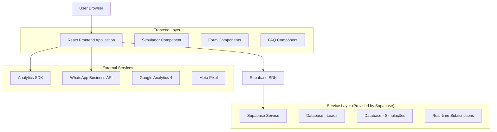
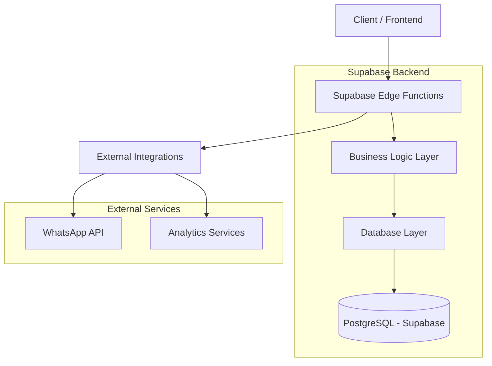
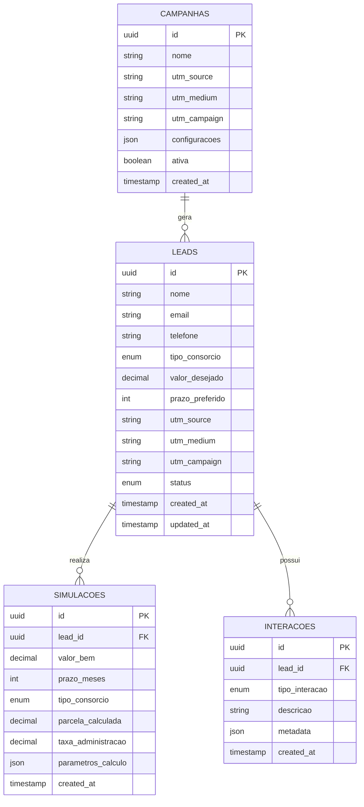

# Arquitetura Técnica - Página de Consórcios Imobiliária Gerais

## 1. Architecture design



## 2. Technology Description

- **Frontend**: React@18 + TypeScript + TailwindCSS@3 + Vite
- **Backend**: Supabase (PostgreSQL + Real-time + Auth)
- **Analytics**: Google Analytics 4 + Meta Pixel + Hotjar
- **Integração**: WhatsApp Business API + Supabase Edge Functions
- **Deploy**: Vercel (otimizado para Next.js/React)

## 3. Route definitions

| Route | Purpose |
|-------|---------|
| /consorcios | Página principal de consórcios com todas as seções |
| /consorcios/simulador | Simulador standalone para campanhas específicas |
| /consorcios/imoveis | Landing page focada em consórcios de imóveis |
| /consorcios/veiculos | Landing page focada em consórcios de veículos |
| /consorcios/servicos | Landing page focada em consórcios de serviços |
| /consorcios/obrigado | Página de confirmação pós-conversão |

## 4. API definitions

### 4.1 Core API

**Captura de Leads**
```
POST /api/leads
```

Request:
| Param Name | Param Type | isRequired | Description |
|------------|------------|------------|-------------|
| nome | string | true | Nome completo do interessado |
| email | string | true | Email válido para contato |
| telefone | string | true | Telefone com DDD |
| tipo_consorcio | enum | true | 'imovel', 'veiculo', 'servico' |
| valor_desejado | number | false | Valor do bem desejado |
| prazo_preferido | number | false | Prazo em meses |
| utm_source | string | false | Origem da campanha |
| utm_medium | string | false | Meio da campanha |
| utm_campaign | string | false | Nome da campanha |

Response:
| Param Name | Param Type | Description |
|------------|------------|-------------|
| success | boolean | Status da operação |
| lead_id | string | ID único do lead gerado |
| message | string | Mensagem de confirmação |

**Simulação de Consórcio**
```
POST /api/simulacao
```

Request:
| Param Name | Param Type | isRequired | Description |
|------------|------------|------------|-------------|
| valor_bem | number | true | Valor do bem desejado |
| prazo_meses | number | true | Prazo em meses (12-180) |
| tipo_consorcio | enum | true | Tipo do consórcio |
| lead_id | string | false | ID do lead associado |

Response:
| Param Name | Param Type | Description |
|------------|------------|-------------|
| parcela_mensal | number | Valor da parcela mensal |
| taxa_administracao | number | Taxa de administração (%) |
| valor_total | number | Valor total do plano |
| economia_vs_financiamento | number | Economia comparada ao financiamento |

## 5. Server architecture diagram



## 6. Data model

### 6.1 Data model definition



### 6.2 Data Definition Language

**Tabela de Leads**
```sql
-- create table
CREATE TABLE leads (
    id UUID PRIMARY KEY DEFAULT gen_random_uuid(),
    nome VARCHAR(255) NOT NULL,
    email VARCHAR(255) NOT NULL,
    telefone VARCHAR(20) NOT NULL,
    tipo_consorcio VARCHAR(20) CHECK (tipo_consorcio IN ('imovel', 'veiculo', 'servico')),
    valor_desejado DECIMAL(12,2),
    prazo_preferido INTEGER,
    utm_source VARCHAR(255),
    utm_medium VARCHAR(255),
    utm_campaign VARCHAR(255),
    status VARCHAR(20) DEFAULT 'novo' CHECK (status IN ('novo', 'contatado', 'qualificado', 'convertido', 'perdido')),
    created_at TIMESTAMP WITH TIME ZONE DEFAULT NOW(),
    updated_at TIMESTAMP WITH TIME ZONE DEFAULT NOW()
);

-- create indexes
CREATE INDEX idx_leads_email ON leads(email);
CREATE INDEX idx_leads_telefone ON leads(telefone);
CREATE INDEX idx_leads_tipo_consorcio ON leads(tipo_consorcio);
CREATE INDEX idx_leads_status ON leads(status);
CREATE INDEX idx_leads_created_at ON leads(created_at DESC);
CREATE INDEX idx_leads_utm_source ON leads(utm_source);

-- Tabela de Simulações
CREATE TABLE simulacoes (
    id UUID PRIMARY KEY DEFAULT gen_random_uuid(),
    lead_id UUID REFERENCES leads(id),
    valor_bem DECIMAL(12,2) NOT NULL,
    prazo_meses INTEGER NOT NULL CHECK (prazo_meses BETWEEN 12 AND 180),
    tipo_consorcio VARCHAR(20) NOT NULL CHECK (tipo_consorcio IN ('imovel', 'veiculo', 'servico')),
    parcela_calculada DECIMAL(10,2) NOT NULL,
    taxa_administracao DECIMAL(5,2) NOT NULL,
    parametros_calculo JSONB,
    created_at TIMESTAMP WITH TIME ZONE DEFAULT NOW()
);

-- create indexes
CREATE INDEX idx_simulacoes_lead_id ON simulacoes(lead_id);
CREATE INDEX idx_simulacoes_tipo_consorcio ON simulacoes(tipo_consorcio);
CREATE INDEX idx_simulacoes_created_at ON simulacoes(created_at DESC);

-- Tabela de Interações
CREATE TABLE interacoes (
    id UUID PRIMARY KEY DEFAULT gen_random_uuid(),
    lead_id UUID REFERENCES leads(id),
    tipo_interacao VARCHAR(50) NOT NULL CHECK (tipo_interacao IN ('simulacao', 'contato_whatsapp', 'email_enviado', 'ligacao', 'agendamento')),
    descricao TEXT,
    metadata JSONB,
    created_at TIMESTAMP WITH TIME ZONE DEFAULT NOW()
);

-- create indexes
CREATE INDEX idx_interacoes_lead_id ON interacoes(lead_id);
CREATE INDEX idx_interacoes_tipo ON interacoes(tipo_interacao);
CREATE INDEX idx_interacoes_created_at ON interacoes(created_at DESC);

-- Tabela de Campanhas
CREATE TABLE campanhas (
    id UUID PRIMARY KEY DEFAULT gen_random_uuid(),
    nome VARCHAR(255) NOT NULL,
    utm_source VARCHAR(255) NOT NULL,
    utm_medium VARCHAR(255) NOT NULL,
    utm_campaign VARCHAR(255) NOT NULL,
    configuracoes JSONB,
    ativa BOOLEAN DEFAULT true,
    created_at TIMESTAMP WITH TIME ZONE DEFAULT NOW()
);

-- create indexes
CREATE UNIQUE INDEX idx_campanhas_utm ON campanhas(utm_source, utm_medium, utm_campaign);
CREATE INDEX idx_campanhas_ativa ON campanhas(ativa);

-- Permissões Supabase
GRANT SELECT ON leads TO anon;
GRANT ALL PRIVILEGES ON leads TO authenticated;
GRANT SELECT ON simulacoes TO anon;
GRANT ALL PRIVILEGES ON simulacoes TO authenticated;
GRANT SELECT ON interacoes TO anon;
GRANT ALL PRIVILEGES ON interacoes TO authenticated;
GRANT SELECT ON campanhas TO anon;
GRANT ALL PRIVILEGES ON campanhas TO authenticated;

-- Políticas RLS (Row Level Security)
ALTER TABLE leads ENABLE ROW LEVEL SECURITY;
ALTER TABLE simulacoes ENABLE ROW LEVEL SECURITY;
ALTER TABLE interacoes ENABLE ROW LEVEL SECURITY;

-- Política para permitir inserção de leads por usuários anônimos
CREATE POLICY "Permitir inserção de leads" ON leads
    FOR INSERT TO anon
    WITH CHECK (true);

-- Política para permitir inserção de simulações por usuários anônimos
CREATE POLICY "Permitir inserção de simulações" ON simulacoes
    FOR INSERT TO anon
    WITH CHECK (true);

-- init data
INSERT INTO campanhas (nome, utm_source, utm_medium, utm_campaign, configuracoes) VALUES
('Campanha Orgânica', 'google', 'organic', 'consorcios_organico', '{"tipo": "organico"}'),
('Campanha Google Ads', 'google', 'cpc', 'consorcios_google_ads', '{"tipo": "pago", "plataforma": "google"}'),
('Campanha Facebook', 'facebook', 'social', 'consorcios_facebook', '{"tipo": "pago", "plataforma": "facebook"}'),
('Campanha Email Marketing', 'email', 'email', 'consorcios_newsletter', '{"tipo": "email", "segmento": "base_clientes"});
```