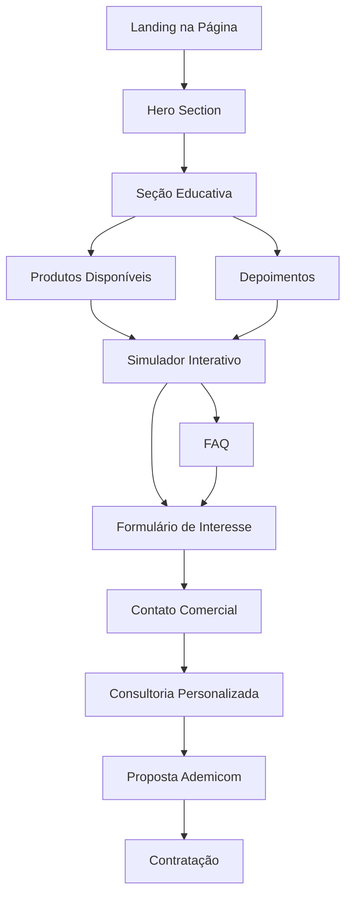

# PRD - Página de Consórcios Imobiliária Gerais

## 1. Product Overview

Desenvolvimento de uma página dedicada para produtos de consórcio da Imobiliária Gerais em parceria com a Ademicom, focada na conversão de leads qualificados e educação do cliente sobre as vantagens dos consórcios como alternativa ao financiamento tradicional.

A página visa posicionar a Imobiliária Gerais como consultora especializada em soluções de consórcio, aproveitando a credibilidade do Dr. Juscelino Neto e oferecendo uma experiência completa desde a simulação até a contratação.

O objetivo é capturar leads de alta intenção de compra para imóveis, veículos e serviços, com foco em conversão através de simulação interativa e acompanhamento consultivo personalizado.

## 2. Core Features

### 2.1 User Roles

| Role | Registration Method | Core Permissions |
|------|---------------------|------------------|
| Visitante Anônimo | Acesso direto à página | Pode navegar, simular e preencher formulários de interesse |
| Lead Qualificado | Preenchimento de formulário de interesse | Recebe contato da equipe e materiais exclusivos |
| Cliente Potencial | Agendamento de consultoria | Acesso a simulações personalizadas e acompanhamento direto |

### 2.2 Feature Module

Nossa página de consórcios consiste nas seguintes seções principais:

1. **Hero Section**: apresentação da proposta de valor, parceria Ademicom e CTA principal para simulação
2. **Seção Educativa**: explicação detalhada sobre consórcios vs financiamento tradicional
3. **Produtos Disponíveis**: detalhamento dos três tipos de consórcio (imóveis, veículos, serviços)
4. **Simulador Interativo**: calculadora de parcelas com captura de leads
5. **Depoimentos**: casos de sucesso e credibilidade social
6. **FAQ Completo**: dúvidas frequentes com respostas detalhadas
7. **Formulário de Contato**: captura de leads com campos qualificadores
8. **Footer Regulatório**: links para documentos legais e compliance

### 2.3 Page Details

| Page Name | Module Name | Feature description |
|-----------|-------------|---------------------|
| Página de Consórcios | Hero Section | Apresenta proposta de valor principal, destaca parceria com Ademicom, inclui citação do Dr. Juscelino e CTA para simulação |
| Página de Consórcios | Seção Diferenciais | Explica vantagens dos consórcios vs financiamento, destaca ausência de juros altos, flexibilidade de uso do crédito |
| Página de Consórcios | Produtos Consórcio | Detalha três modalidades (imóveis, veículos, serviços) com benefícios específicos e casos de uso |
| Página de Consórcios | Simulador Interativo | Permite cálculo de parcelas por valor/prazo, captura dados do lead, integra com CRM interno |
| Página de Consórcios | Seção Depoimentos | Exibe casos de sucesso reais, reforça credibilidade da parceria, inclui fotos e nomes dos clientes |
| Página de Consórcios | FAQ Expandível | Lista 8+ perguntas frequentes com respostas detalhadas, inclui links para regulamentação |
| Página de Consórcios | Formulário Contato | Captura leads qualificados com campos obrigatórios (nome, telefone, email, interesse), integra com WhatsApp |
| Página de Consórcios | Footer Compliance | Links para documentos regulatórios, termos de uso, política de privacidade, informações da Ademicom |

## 3. Core Process

**Fluxo Principal do Usuário:**
O usuário acessa a página através de campanhas de marketing ou busca orgânica, é impactado pela proposta de valor na hero section, navega pelas seções educativas para entender os benefícios dos consórcios, utiliza o simulador interativo para calcular parcelas adequadas ao seu perfil, preenche o formulário de interesse e é contatado pela equipe especializada para consultoria personalizada.

**Fluxo de Conversão:**
Visitante → Educação sobre consórcios → Simulação interativa → Captura de lead → Contato comercial → Agendamento de consultoria → Proposta personalizada → Contratação

## 4. User Interface Design

### 4.1 Design Style

- **Cores Primárias**: Vermelho Minas (#C0362C) para CTAs e elementos de destaque, Creme (#F7F4F2) para backgrounds suaves
- **Cores Secundárias**: Dourado (#D9A441) para destaques premium, Tinta (#403B3B) para textos principais, Muted (#7A7373) para textos secundários
- **Estilo de Botões**: Arredondados (border-radius: 14px), com sombras suaves e efeitos hover, hierarquia clara entre primário e secundário
- **Tipografia**: Nunito (400, 600, 800), tamanhos responsivos com clamp(), espaçamento otimizado para legibilidade
- **Layout**: Card-based com sombras suaves, navegação superior fixa, seções bem definidas com espaçamento generoso
- **Ícones**: Estilo outline minimalista, cores consistentes com a paleta, tamanhos padronizados (18px, 24px, 32px)

### 4.2 Page Design Overview

| Page Name | Module Name | UI Elements |
|-----------|-------------|-------------|
| Página de Consórcios | Hero Section | Background gradient sutil, card principal centralizado, logo Ademicom, citação destacada em itálico, botão CTA vermelho com sombra |
| Página de Consórcios | Seção Diferenciais | Layout em três colunas responsivas, ícones explicativos, cards com hover effects, cores de destaque para benefícios |
| Página de Consórcios | Produtos Consórcio | Cards verticais com ícones temáticos, listas com checkmarks verdes, botões secundários para cada modalidade |
| Página de Consórcios | Simulador Interativo | Card destacado com background creme, inputs estilizados, slider para valores, resultado em destaque dourado |
| Página de Consórcios | Seção Depoimentos | Carousel responsivo, cards com fotos circulares, aspas estilizadas, rating com estrelas douradas |
| Página de Consórcios | FAQ Expandível | Accordion com animações suaves, ícones de expand/collapse, texto hierarquizado, links destacados |
| Página de Consórcios | Formulário Contato | Card centralizado, inputs com labels flutuantes, validação em tempo real, botão WhatsApp verde |
| Página de Consórcios | Footer Compliance | Layout em colunas, links organizados por categoria, logos das empresas, informações de contato |

### 4.3 Responsiveness

A página é desenvolvida com abordagem mobile-first, garantindo experiência otimizada em dispositivos móveis (390px+) e escalando adequadamente para tablets (768px+) e desktops (1024px+). Inclui otimizações para touch interaction, navegação por gestos e carregamento progressivo de imagens. Todos os elementos interativos possuem área mínima de toque de 44px e feedback visual adequado.